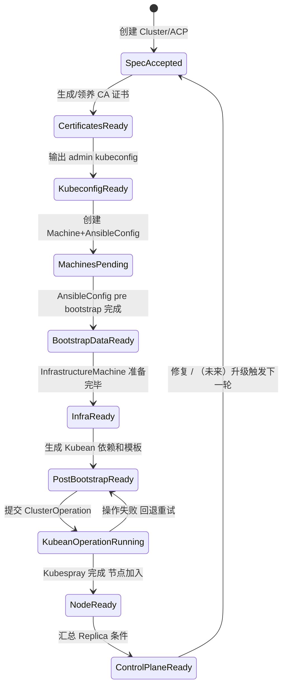
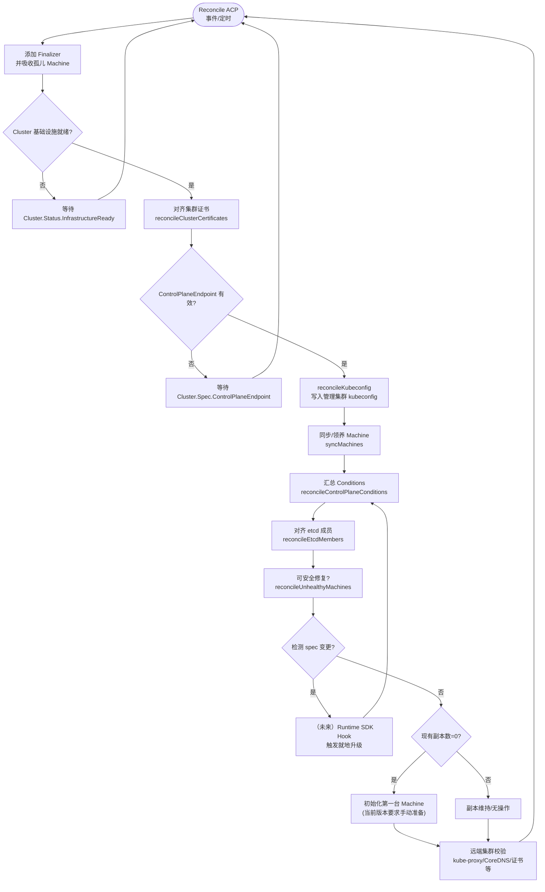

# 基于 Ansible 的控制平面管理方案

## 目录

<!-- START doctoc generated TOC please keep comment here to allow auto update -->
<!-- DON'T EDIT THIS SECTION, INSTEAD RE-RUN doctoc TO UPDATE -->

- [术语](#术语)
- [摘要](#摘要)
- [动机](#动机)
    - [目标](#目标)
    - [非目标 / 后续工作](#非目标--后续工作)
- [方案](#方案)
    - [用户故事](#用户故事)
        - [故事衍生的能力](#故事衍生的能力)
    - [架构概览](#架构概览)
    - [状态流转（与 Cluster API 交互）](#状态流转与-cluster-api-交互)
    - [与 KubeadmControlPlane 语义对齐](#与-kubeadmcontrolplane-语义对齐)
    - [实现细节](#实现细节)
        - [新增 / 复用的 API](#新增--复用的-api)
        - [控制循环](#控制循环)
        - [升级策略、扩缩容与修复](#升级策略扩缩容与修复)
    - [风险与缓解](#风险与缓解)
- [设计细节](#设计细节)
    - [测试计划](#测试计划)
    - [毕业标准](#毕业标准)
    - [升级策略](#升级策略)
- [备选方案](#备选方案)
- [实现历史](#实现历史)

<!-- END doctoc generated TOC please keep comment here to allow auto update -->

## 术语

- **ABP**：Ansible Bootstrap Provider（sigs.k8s.io/cluster-api/bootstrap/ansible）。
- **ACP**：Ansible Control Plane，本文提出的控制面实现。
- **Kubean**：kubean-io 维护的 Operator，封装 Kubespray Playbook。
- **Kubeadm 提案**：参考《20191017-kubeadm-based-control-plane》，本文沿用其章节结构，但替换核心技术栈。

## 摘要

Cluster API 目前默认的控制面实现依赖 kubeadm。然而在一些高度定制、离线或延用既有 Ansible Playbook 的环境中，operator 更希望沿用 Ansible/Kubean 生态。本文提出 `AnsibleControlPlane`（ACP）架构：利用 ABP 的 pre/post bootstrap 能力生成受信 CA、inventory、vars 及 SSH 密钥，再由 Kubean Operator 执行 Kubespray。**当前阶段仅支持创建与维护固定副本数的控制面，不提供升级或扩/缩容能力**。我们计划在未来版本中参考 Runtime SDK 的 In-Place Update Hooks，为 ACP 引入安全的就地升级能力。

## 动机

1. **复用既有 Ansible 资产**：大量组织的控制面“黄金模板”已沉淀在 Kubespray/Ansible 中，迁移到 kubeadm 成本高。
2. **复杂拓扑需求**：多角色（etcd/ingress/监控）或异构硬件需要通过 inventory 精确定义，这方面 Ansible 优势更明显。
3. **离线与合规场景**：Ansible 更容易处理私有镜像、特殊安全审计和自定义文件分发。
4. **控制平面体验统一**：Cluster API 需要一个官方的 Ansible 控制面抽象，保持与 kubeadm 控制面同等 UX，避免 provider 内重复造轮子。

### 目标

- 定义 `AnsibleControlPlane`/`AnsibleControlPlaneTemplate` API，暴露版本、副本（视为常量）及基础模板字段。
- 让 ABP 中的 `AnsibleConfig` 支持自动生成 Kubean Cluster/ClusterOperation 以及依赖 ConfigMap/Secret。
- 在 pre bootstrap 阶段注入 CA、额外文件；post 阶段管理 Kubean 资源与租约锁，保证幂等。
- 为控制平面生命周期（创建、运行态监控、修复）提供清晰状态与条件。
- 预留与 Runtime SDK In-Place Update Hooks 集成的接口，为未来引入升级能力打基础。

### 非目标 / 后续工作

- 不重写 kubeadm 能力或试图兼容其配置；Ansible/Kubean 逻辑独立演进。
- 不管理基础设施层的负载均衡、网络、CNI 或额外业务组件。
- 不在本提案中提供 etcd 灾备或零节点恢复方案，交由外部流程处理。
- 不改变用户自备 Ansible Playbook 的能力；ACP 仅负责 orchestrator。
- 当前版本不支持滚动升级，也不处理任何形式的版本升级。我们参考 Cluster API Runtime SDK 的 [Implement In-Place Update Hooks](https://cluster-api.sigs.k8s.io/tasks/experimental-features/runtime-sdk/implement-in-place-update-hooks)，计划在未来版本中以此为基础交付升级能力。

## 方案

### 用户故事

1. 作为平台工程师，我需要声明式地使用 Kubespray 构建控制面，而无需手动触发 Playbook。
2. 作为安全团队，我需要确保 CA、SSH 等凭据由 Cluster API 管控，并在节点 provision 时写入指定路径。
3. 作为 SRE，我希望在没有升级/扩缩容的场景下也能持续观测控制面健康，快速定位问题。
4. 作为值班人员，我想要明确区分“pre bootstrap 失败”还是“Kubean 执行失败”，方便排障。
5. 作为平台规划者，我希望未来能够在 ACP 上执行安全的就地升级（基于 Runtime SDK hooks），当前阶段希望文档明确这一演进路线。

#### 故事衍生的能力

1. `AnsibleControlPlane` 必须驱动 Machine + AnsibleConfig 的创建，并能观测 Machine 状态；
2. AnsibleConfig pre bootstrap 需要写入 CA、额外文件并生成 bootstrap Secret；
3. post bootstrap 必须等基础设施 ready 后再生成 Kubean Cluster/ClusterOperation，以及 hosts/vars ConfigMap 与 SSH Secret；
4. 控制器要在 `status.conditions` 中区分 DataSecret、PostBootstrap 等阶段，并在未来版本扩展 `UpgradePending/UpgradeRunning` 等语义；
5. 所有自动生成的资源带 `cluster.x-k8s.io/cluster-name` 标签与 ownerReference，保证垃圾回收；
6. 当前阶段保持副本静态，在未来版本中通过 Runtime SDK hook 实现受控的就地升级。

### 架构概览

```
┌─────────────────────────────────────────────────────────┐
│ 管理集群                                                 │
│                                                         │
│  ┌────────────────┐    ┌─────────────────────────────┐ │
│  │ AnsibleControl │→→→│  Machine/AnsibleConfig 控制器 │ │
│  │ Plane 控制器    │    │  (pre/post bootstrap)       │ │
│  └────────────────┘    └─────────────────────────────┘ │
│            │                       │                    │
│            │ Kubeconfig/Status     │ Kubean Cluster/Ops │
│            ▼                       ▼                    │
│       Machine Controller      Kubean Operator           │
│            │                       │                    │
│            ▼                       ▼                    │
│          基础设施           Kubespray Playbook          │
│            │                       │                    │
│            ▼                       ▼                    │
│          工作负载集群（节点加入、Node Ready）            │
└─────────────────────────────────────────────────────────┘
```

关键要点：

- AnsibleControlPlane 负责声明副本、版本与生命周期监控策略，并与 Machine Controller 协作；
- AnsibleConfig 控制器负责两阶段逻辑：pre bootstrap 渲染 cloud-init 写 CA；post bootstrap 根据模板生成 Kubean 资源；
- Kubean Operator 监听 `cluster.kubean.io` 与 `clusterops.kubean.io` CRD，执行 Kubespray 并在完成后让节点就绪；
- 状态通过 Conditions 回传至 AnsibleControlPlane，确保用户感知整体生命周期。

### 状态流转（与 Cluster API 交互）

ACP 需要像 KubeadmControlPlane 一样暴露清晰的状态，让上层（Cluster、ClusterTopology、MHC）可以依赖。因此我们将完整生命周期拆成 9 个阶段（含证书与 kubeconfig 两个关键节点），并映射到与 Cluster API 常见条件/字段一致的语义，便于观测与编排。

#### 状态图



#### 状态说明

| 状态 | 触发/责任 | 集成点 | 失败回退 |
| --- | --- | --- | --- |
| SpecAccepted | ACP 控制器创建/更新 `Machine`、`AnsibleConfig` | `AnsibleControlPlane.status.observedGeneration`、`Ready` condition | Requeue，事件 `SpecReconcileError` |
| CertificatesReady | `reconcileClusterCertificates` 生成或校验 CA Secret | `CertificatesAvailableCondition`、Secret `<cluster>-ca` ownerRef | Secret 创建失败则标记 `CertificatesGenerationFailed`，重试 |
| KubeconfigReady | `reconcileKubeconfig` 生成 admin kubeconfig | `Cluster` Kubeconfig Secret、事件 `KubeconfigGenerated` | 若 kubeconfig 未生成，保持 `KubeconfigReady` 为 False，重试 |
| MachinesPending | Machine Controller 等待 infra provider | `Machine.status.phase=Pending`，`BootstrapReady=false` | 删除未完成的 Machine 或重试创建 |
| BootstrapDataReady | AnsibleConfig（pre）写入 CA/文件并创建 DataSecret | `Machine.status.bootstrapReady=true`、ACP 条件 `DataSecretAvailable` | 若 Secret 失败则记录 `PreBootstrapFailed` 并重试 |
| InfraReady | Infra provider 将 Machine 置为 `InfrastructureReady=true` | 标准 CAPI 字段 `status.infrastructureReady` | ACP 不介入，仅在 condition 失败时记录事件 |
| PostBootstrapReady | AnsibleConfig（post）生成 hosts/vars ConfigMap、SSH Secret、Kubean Cluster | 自定义条件 `PostBootstrapReady`；Kubean 依赖具备 ownerRef | 若 ConfigMap/Secret 写入冲突，Lease 退避并回到 `InfraReady` |
| KubeanOperationRunning | ClusterOperation 控制 Kubean Operator 执行 playbook | `ClusterOperation.status.phase={Running,Failed}` 同步到 ACP 条件 `KubeanOperationHealthy` | 失败时重建 ClusterOperation 或标记 `Degraded` |
| NodeReady | Machine controller 观察 Node Ready，设置 `status.phase=Running` | 标准条件 `MachineReady` | 若 Kubespray 未完成则回退 `KubeanOperationRunning` |
| ControlPlaneReady | ACP 统计 `spec.replicas`、`status.updatedReplicas`、Conditions | `AnsibleControlPlane.status.conditions[Ready,Available,Progressing]` | 若任一副本失效，ACP 回滚至 `SpecAccepted` 重新调和 |

在实现上，我们建议：

1. **共享条件名称**：复用 `DataSecretAvailable`、`CertificatesAvailable`、`MachinesCreated`、`Available` 等 KCP 条件，并新增 `PostBootstrapReady`、`KubeanOperationHealthy`，便于上层自动化沿用同一监控规则。
2. **证书/kubeconfig 兜底**：证书与 kubeconfig 失败会生成 `CertificatesGenerationFailed`、`KubeconfigReconcileFailed` 等事件，帮助运维定位“为什么控制面尚未创建 Machine”。
3. **事件归因**：每个阶段失败都发出结构化事件（`Reason` = `PreBootstrapFailed`/`KubeanOperationTimeout` 等），方便 SRE 快速定位。
4. **与 MachineHealthCheck 联动**：若 MHC 删除失效 Machine，ACP 根据当前阶段决定是否需要重新执行 Kubespray（例如 `NodeReady` 之后扩缩容 vs. `KubeanOperationRunning` 中断重试）。
5. **可观察指标**：为各阶段暴露 `ReconcileDuration`、`Attempts` 等 Prometheus 指标，使用户对齐控制面 SLA。

### 与 KubeadmControlPlane 语义对齐

我们逐段阅读了 `controlplane/kubeadm/internal/controllers/controller.go`、`scale.go`、`upgrade.go` 等实现，以确定 ACP 流程需要兼容的语义。下图把 KCP 的关键步骤映射到 ACP 的相应处理，并明确哪些能力在当前版本被裁剪（如扩缩容、滚动升级）。



关键对齐点：

1. **入口条件**：ACP 同样只有在 Cluster infra ready 且 ControlPlaneEndpoint 已设置时才继续，满足 CAPI 合同。
2. **证书与 kubeconfig**：复用 `secret.NewCertificatesForInitialControlPlane` 语义，保证 `CertificatesAvailable` 与用户访问入口一致。
3. **Machine 处理**：`syncMachines`/conditions 聚合逻辑保持一致，ACP 仅替换 Kubeadm bootstrap 步骤为 Ansible/Kubean。
4. **Etcd 与修复**：沿用 `reconcileEtcdMembers` 与 `reconcileUnhealthyMachines` 的前置条件，确保 ACP 仍遵循 KCP 的安全闸。
5. **升级决策**：KCP 中 `upgradeControlPlane` 会滚动副本；ACP 暂未实现任何升级逻辑，而是预留节点以便未来接入 Runtime SDK In-Place Hook 时复用相同的条件（如 `MachinesSpecUpToDate`）。
6. **扩缩容**：KCP 有 `initialize/scaleUp/scaleDown` 路径；ACP 暂时不开放，流程图中标注为“维持副本”。未来若启用，将重新连接到这些分支。

通过该映射，我们可以保证 ACP 暂不实现的能力（扩缩容、滚动升级）依旧保持语义兼容，后续新增能力时亦可直接挂载到同一流程节点。

### 实现细节

#### 新增 / 复用的 API

- **AnsibleControlPlane**：
    - `spec.version`、`spec.replicas`、`spec.rolloutStrategy`、`spec.machineTemplate`；
    - `spec.ansibleConfigSpec` 指向 ABP 配置（可嵌入 `clusterTemplate`、`clusterOperationTemplate`）；
    - `status` 含 `ready`、`initialized`、`replicas`、`updatedReplicas`、`conditions`；
    - 当前阶段 `spec.version` 视为只写一次（创建时），当用户尝试修改时返回 `UpgradeNotSupported` 事件或条件。
- **AnsibleControlPlaneTemplate**：供 ClusterClass 使用。
- **AnsibleConfig（扩展）**：
    - 支持 `clusterTemplate`/`clusterOperationTemplate` 自动填写 apiVersion/kind/name，并允许用户覆盖 spec；
    - `status.postBootstrapCompleted` 指示 Kubean 资源已准备完毕。
    - `ClusterOperation` 计划遵循与 KCP 相同的 init lock 语义：
        - 仅带有 `kube-master` 角色的 Machine 会争抢 ConfigMap 锁并执行 `cluster.yml`，确保始终只有一个首控节点完成初始化；
        - 其他控制面（`kube-master`/`etcd`）以及附加角色的节点会在 `ControlPlaneInitialized` 变为 True 之前持续等待，不会提前触发 `scale.yml`；
        - 初始化完成后所有节点统一执行 `scale.yml`，并通过 `vars.scale_master=true/false` 区分 master 与非 master，保持 Kubespray 行为一致。
- **Kubean CRD**（外部项目提供）：`Cluster`、`ClusterOperation`、`ClusterOperationStatus`。

#### 控制循环

1. **pre bootstrap**：
    - 根据 `spec.certRef` 或默认 `<cluster-name>-ca` Secret 读取 `tls.crt`/`tls.key`；
    - 生成 `/etc/kubernetes/ssl/ca.pem`、`ca-key.pem` 及用户定义文件，写入 cloud-init；
    - 创建 bootstrap Secret，将 `status.dataSecretName` 与 `DataSecretAvailable` 置为 ready。
2. **post bootstrap**：
    - 若 Machine `status.infrastructureReady=false`，仅记录日志并等待；
    - `ensureKubeanClusterDependencies`：
        - 通过 `buildHostsInventory` 使用 Machine IP 与 `AnsibleConfig.spec.role` 组装 inventory，将单节点映射到多个 Ansible group，并聚合同一 Cluster 中所有 `kube-master`、`etcd` 角色节点（按创建时间排序）以满足扩容依赖；
        - `ensureConfigMapsWithLock` 使用 Lease 防止多个控制器同时写入同名 ConfigMap；
        - `ensureSSHAuthSecret` 确保 SSH Secret 存在并加 ownerRef；
    - `applyResourceFromTemplate` 创建/更新 Kubean Cluster 与 ClusterOperation：
        - 默认命名：`<cluster-name>`、`<cluster-name>-hosts-conf`、`<cluster-name>-vars-conf`、`<cluster-name>-ssh-auth`、`<cluster-name>-init`；
        - 若用户提供模板，使用深度合并保持默认字段并允许覆盖；
    - 成功后释放租约锁，设置 `postBootstrapCompleted=true`。
3. **AnsibleControlPlane** 监听 `AnsibleConfig`/Machine 状态，维持既有副本并汇总 Conditions；未来在此阶段插入升级 hook。

#### 升级策略、扩缩容与修复

- **升级规划（未来实现）**：
    - 当前版本禁止任何 `spec.version` 变更，控制器可通过 Validating Webhook 或条件事件提示“升级未支持”；
    - 我们计划基于 Runtime SDK 的 In-Place Update Hooks（参见官方文档）在未来实现安全的就地升级：ACP 负责准备 Kubean/Kubespray 所需的上下文，由 Hook 注入升级任务，保持与 KCP 条件语义一致。
- **扩缩容（暂不支持）**：
    - `spec.replicas` 视为只读，ACP 不会创建或删除 Machine；
    - 若用户手动调整 Machine 数量，ACP 也不会自动平衡，只会继续维护已有对象的 bootstrap 依赖。
- **修复**：
    - 若 MachineHealthCheck 删除失效节点，ACP 协助新 Machine 完成 pre/post bootstrap，确保 Kubespray 仍能部署控制面组件；
    - 条件中会记录失败原因，如 `KubeanOperationFailed`，以便告警，并在恢复后标记 `PostBootstrapReady`。

### 风险与缓解

| 风险 | 描述 | 缓解 |
| --- | --- | --- |
| ConfigMap/Secret 并发写入 | 多个控制器副本同时生成 inventory/vars | 引入 Lease 锁 + ownerRef，失败则重试并 RequeueAfter |
| Kubespray 版本不匹配 | 用户自定义镜像或 playbook 与生成的 inventory 不兼容 | 模板允许覆盖所有 spec 字段；控制器事件记录失败并提示检查 Kubespray 版本 |
| 证书泄漏 | pre bootstrap 重复读取 CA Secret | 默认在同 namespace 中访问；ownerRef 指向 AnsibleConfig，删除时自动清理 |
| 资源漂移 | 用户手动修改/删除 Kubean CR | reconcile 检测 NotFound 并重新 apply，保证期望状态 |

## 设计细节

### 测试计划

1. **单元测试**：
    - `buildClusterResourceTemplate`/`buildClusterOperationResourceTemplate` 覆盖默认命名、模板覆盖、错误处理；
    - `ensureConfigMapsWithLock` 验证租约竞争；
    - `buildHostsInventory` 断言拓扑转换；
    - `mergeSpecMaps` 深度合并逻辑。
2. **envtest 集成测试**：
    - 伪造 Machine/Cluster，创建 AnsibleConfig，断言 Secret/ConfigMap/Kubean 资源以及 ownerRef；
    - 模拟锁冲突与重新调和。
3. **e2e**：
    - 在 kind 中部署 Kubean Operator，创建 1 节点与 3 节点控制面，验证 Node Ready；
    - 尝试修改 `spec.version` 并验证控制器/验证 webhook 阻止升级且提供清晰事件；
    - 故障注入（删除 ConfigMap/ClusterOperation），观察自动恢复。

### 毕业标准

| 阶段 | 要求 |
| --- | --- |
| Alpha | CRD、控制器合入，单元+envtest 通过，可创建最小控制面 |
| Beta | e2e 稳定；与 MachineHealthCheck 集成；验证“升级未支持”路径（webhook/条件）可用；文档齐备 |
| GA | 完成 Runtime SDK In-Place Hook 升级特性并通过长周期测试；多实例 HA 运行验证；性能基准（>50 控制面并发） |

### 升级策略

- 当前版本仅在创建阶段写入 `spec.version`，并在用户修改时返回 `UpgradeNotSupported`，防止不安全操作。
- Webhook 负责将旧字段 `clusterRef`/`clusterOpsRef` 迁移到新的模板字段，确保向后兼容。
- 未来引入 Runtime SDK In-Place Update Hooks 时，ACP 将在 `NeedsUpgrade` 节点调用 Hook，提供：
    - 访问 Machine/Cluster/AnsibleConfig 的上下文，用于准备 Kubespray 升级任务；
    - 状态桥接：Hook 结果写入 `MachinesSpecUpToDate`、`Available` 等条件，保持与 KCP 一致；
    - 幂等保障：Hook 运行需要租约锁，与 post bootstrap 逻辑共用。

## 备选方案

1. **在 KCP 内增加 Ansible 模式**：最终放弃，因为会让 kubeadm 控制器膨胀且语义混乱。
2. **完全交由 Kubean Operator 编排**：Cluster API 仅触发事件，不掌控状态，无法满足统一 UX 与条件回报。
3. **使用 MachineDeployment 管控控制面**：难以覆盖 etcd/控制面语义，且破坏现有控制面 provider 分层。

## 实现历史

- 2024 Q4：ABP 引入 `clusterTemplate`/`clusterOperationTemplate` 字段。
- 2025 Q2：ABP 新增 ConfigMap/Secret 租约锁，确保并发安全。
- 2026-02：提出本文档，计划实现 `AnsibleControlPlane` 与相应控制器。

## 数据模型 
spec
```text
type AnsibleControlPlaneSpec struct {
	// EtcdReplicas is the desired number of etcd Machines.
	// 默认为 0 （融合架构），当显式设置为正整数时表示存在独立的 etcd 角色。
	// +optional
	EtcdReplicas *int32 `json:"etcdReplicas,omitempty"`
	
	// Replicas is the desired number of control plane Machines.
	// 默认为 1。
	// +optional
	Replicas *int32 `json:"replicas,omitempty"`

	// Version is the Kubernetes version for the control plane nodes.
	// +kubebuilder:validation:MinLength=2
	Version string `json:"version"`

	// MachineTemplate describes the infrastructure used for control plane Machines.
	MachineTemplate clusterv1.MachineTemplateSpec `json:"machineTemplate"`

	// AnsibleConfigSpec carries the bootstrap configuration driven by the Ansible Bootstrap Provider.
	AnsibleConfigSpec bootstrapv1.AnsibleConfigSpec `json:"ansibleConfigSpec"`
}
```
status
```text
type AnsibleControlPlaneStatus struct {
    // Selector 公开 scale sub资源依赖的 label selector
    Selector string `json:"selector,omitempty"`
    // 副本统计（与 KCP 对齐）
    Replicas int32 `json:"replicas,omitempty"`
    ReadyReplicas int32 `json:"readyReplicas,omitempty"`
    UpdatedReplicas int32 `json:"updatedReplicas,omitempty"`
    AvailableReplicas int32 `json:"availableReplicas,omitempty"`
    UnavailableReplicas int32 `json:"unavailableReplicas,omitempty"`
    Version *string `json:"version,omitempty"`
    // EtcdInitialMachines 记录参与 etcd 初始化的 Machine 引用；ControlPlaneInitialMachine 记录首个 master
    EtcdInitialMachines []corev1.ObjectReference `json:"etcdInitialMachines,omitempty"`
    ControlPlaneInitialMachine *corev1.ObjectReference `json:"controlPlaneInitialMachine,omitempty"`
    // Initialized/Ready 是 contract 要求的布尔状态
    Initialized bool `json:"initialized,omitempty"`
    Ready bool `json:"ready,omitempty"`
    FailureReason string `json:"failureReason,omitempty"`
    FailureMessage *string `json:"failureMessage,omitempty"`
    ObservedGeneration int64 `json:"observedGeneration,omitempty"`
    CurrentVersion string `json:"currentVersion,omitempty"`
    Conditions clusterv1.Conditions `json:"conditions,omitempty"`
}
```

## 参考
https://cluster-api.sigs.k8s.io/developer/providers/contracts/bootstrap-config
